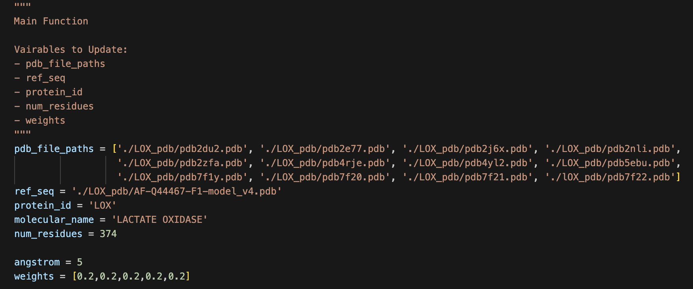
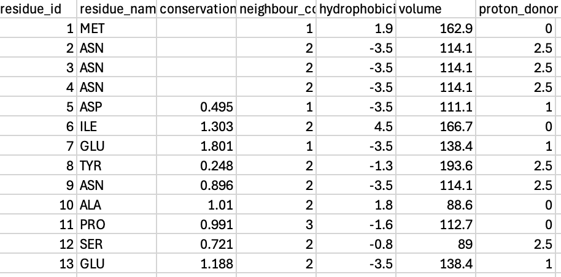
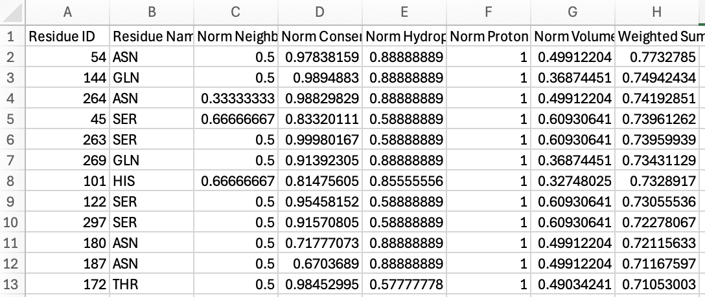

# Analysis of Protein Sequence (for Generative Protein Design)

V1.0 by Xiang Yang, 22 August 2024

# Overview
AlphaFold3 uses a generative diffusion model to predict protein structure from input protein sequences. <br>

Protein designers can insert their own constraints to bias the diffusion model's gaussian denoising process, thereby producing novel proteins with desired properties. <br>

This project analyses a protein sequence on the basis of 5 parameters: N-Neighbour Count, Conservation Score, Hydrophobicity, Volume and Proton Donating/Accepting Ability.


# How to Use
For the selected protein, obtain the consensus sequence from the [AlphaFold Protein Database](https://alphafold.ebi.ac.uk/). This sequence will be used as a backbone for other experimentally determined PDB data to be mapped on.

Experimental information from PDB sequences are obtained from [Uniprot Database](https://www.uniprot.org/).

Save the pdb files in a folder named <i>protein_pdb</i> under your working directory. At the `main` function, update the variables <i>pdb_file_paths</i>, <i>ref_seq</i>, <i>protein_id</i> and <i>num_residues</i>.

Run the `main` function
<br>

## Example Use (Protein: Lactate Oxidase)

Uniprot PDB Files:<br>


PDB File Download from EMBL-EBI Page<br>


AlphaFold Protein Database:<br>


#### Sample Inputs:<br>


#### Sample Outputs<br>
(1) Neighbour Count & Conservation Score Merged Plot<br>


(2) Summary Plot<br>


(3) Summary in CSV<br>


(4) Analysis Output in CSV<br>



## Inputs: 
(1) Experimental PDB files of <i>target protein</i> obtained through Uniprot <br>
(2) Consensus Sequence PDB file obtained through AlphaFoldDB <br>
(3) Protein ID and Name <br>
(4) Number of Residues <br>
(5) Weights for analysis of protein sequence

## Outputs:
(1) Sequence alignment of pdb files to consensus sequence in csv format <br>
(2) Compiled data of protein sequence with 5 parameters in csv format <br>
(3) N-Neighbour and Conservation Score Plot
<br>
(4) Visual plot of the protein sequence and properties of amino acids <br>
(5) Weighted sums of normalised data for each amino acid

# Functions
### 1.1 download_conservation_scores
```
Downloads conservation score from Consurf Database using specific PDB file

Input:
- pdb_file_path (str): Path to PDB file
- protein_id (str): Protein ID
- chains (str): Chain ID

Output:
- Folder with conservation score in txt format, file named with PDB ID 
```
### 1.2 extract_consevation_score
```
Extracts conservation scores from downloaded conservation score files. Returns a list of dictionaries containing residue id, residue name and conservation score
```
### 1.4 extract_chain_ids
```
Extracts chain ids from a PDB file that correspond to a given molecular name

Input:
- pdb_file_path (str): path to PDB file
- molecular name (str)

Output:
- List of chain IDs that contain molecular name
```
### 1.4 extract_pdb_info
```
Reads a PDB file and extracts 3D spatial coordinates and amino acids, applying residue ID corrections based on DBREF entries if available

Input:
- pdb_file_path (str): Path to the PDB file

Output:  
- A list of dictionaries, each containing information about each atom
- Dictionary with chain IDs as keys and residue ID offsets as values
```
### 1.5 align_sequences
```
Aligns sequences from the reference and PDB sequences based on residue IDs, and sorts the columns by chain ID for each PDB file. 
```
### 1.6 align_pdb
```
Aligns and compares sequences from the reference and PDB files, without handling offsets and outputs a csv with aligned sequences 
```
### 1.7 extract_sites
```
Extracts binding site information from a list of PDB files

Input:
- pdb_file_paths: List of PDB file paths

Output:
- `binding_sites`: Dictionary where keys are (`residue_id`, `residue_name`) and values are comma-separated pdb_ids with chain_ids
```

### 2.1 find_nearest_neighbour
```
Find the n-neighbors closest to the 'CA' atoms in the data using brute force with Euclidean distance.

Input:
- data: list of dictionaries, each containing atom information
- angstrom (float): distance threshold for neighbour counting

Output:
- data: list of dictionaries, containing only 'CA' atoms with updated 'neighbour_count' field, and without 'model_id', 'atom_name', and 'atom_coords' keys.
```
### 2.2 find_hydrophobicity
```
Assign hydrophobicity values to an amino acid, using IMGT Scale

Input:
- aa_residue: Dict Object with 'residue_name'

Ouput:
- aa_residue: Dict Object with 'hydrophobicity' key
```
### 2.3 find_volume
```
Assign volume to an amino acid, using IMGT Scale

Input:
- aa_residue: Dict object with 'residue_name'

Ouput:
- aa_residue: Dict object with 'volume' key
```
### 2.4 find_proton_donor
```
Classifies amino acid based on proton accepting/donating ability

Input:
- aa_residue: Dict object with 'residue_name'

Ouput:
- aa_residue: Dict object with 'proton_donor' key
```
### 2.4 merge_residue_data
```
Merges conservation score and neighbour count, then assigns hydrophobicity, volume and proton donor/acceptor

Input:
- conservation_scores: List of dictionaries with conservation score
- neighbour_counts: List of dictionaries with neighbour count
- chain_ids
- chain_offsets

Output:
- merged_data: List of dictionaries with residue id, residue name, consevation score, neighbour count, hydrophobicity, volume and proton donor/acceptor
```
### 2.5 pdb_to_compiled_vector
```
For each pdb sequence, outputs the combined data with all 5 parameters

Input:
- pdb_file_path (str)
- angstrom (int)
- protein_id (str)
- molecular_name (str)

Output:
- merged_residues: List of dictionaries with with residue id, residue name, consevation score, neighbour count, hydrophobicity, volume and proton donor/acceptor
```
### 2.6 merge_to_ref_seq
```
Updates cosesnsus sequence with information extracted from PDB file

Input:
- ref_seq (str): File path to consensus sequence
- completed (dict): Processed pdb file to be updates to ref_seq

Output:
- updated_ref_seq: List of dictionaries
```
### 3.1 plot_and_calculate_correlation
```
Plots neighbout count and conservation scores for all residues

Input: 
- data: List of dictionaries
- angstrom
- protein_id
- num_residues

Output:
- scatter plot: y axes are neighbour count and conservation score, x axis is residue id
- caculated correlation between neighbour counts and conservations scores
```
### 3.2 plot_residue_properties
```
Plots the different parameters of each amino acid residue

Input:
- data: List of dictionaries
- protein_id
- num_residues

Output:
- summary chart with 5 parameters
```
### 3.3 analyse_protein
```
Sets requirements for the 5 parameters and returns a list of amino acids that fulfil X number of criteria out of the five.

Input:
- residues: list of dictionaries
- protein_id

Output
- amino_acids: list of residues that fulfil the requirement
```
### 3.4 analyse_protein2
```
Normalises data to range between 0 and 1, and returns weighted sum from the five parameters, outputs processes data as a csv file whiich is sorted by weighted sum.

Input:
- residues: list of dictionaries
- weights (float)
- protein_id

Output:
- csv file with normalised data and weighted sum of each residue
```