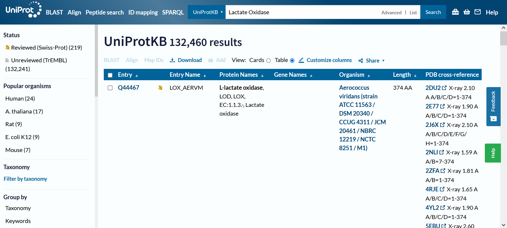
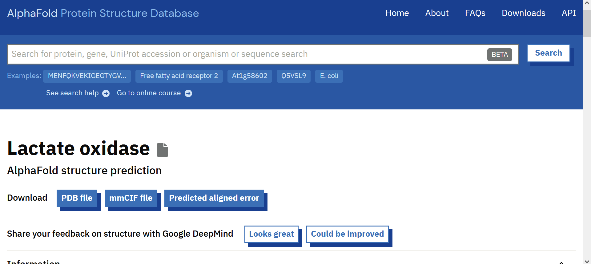

# Analysis of Protein Sequence (for Generative Protein Design)

V0.2 by Xiang Yang, 31 July 2024

# Overview
AlphaFold3 uses a generative diffusion model to predict protein structure from input protein sequences. <br>

Protein designers can insert their own constraints to bias the diffusion model's gaussian denoising process, thereby producing novel proteins with desired properties. <br>

This project analyses a protein sequence on the basis of 5 parameters: N-Neighbour Count, Conservation Score, Hydrophobicity, Volume and Proton Donating/Accepting Ability.


# How to Use
For the selected protein, obtain the consensus sequence from the [AlphaFold Protein Database](https://alphafold.ebi.ac.uk/). This sequence will be used as a backbone for other experimentally determined PDB data to be mapped on.

Experimental information from PDB sequences are obtained from [Uniprot Database](https://www.uniprot.org/).

Save the pdb files in a folder named <i>protein_pdb</i> under your working directory. At the `main` function, update the variables <i>pdb_file_paths</i>, <i>ref_seq</i>, <i>protein_id</i> and <i>num_residues</i>.

Run the `main` function
<br>

## Example Use (Protein: Lactate Oxidase)

Uniprot PDB Files:



AlphaFold Protein Database:


## Inputs: 
(1) Experimental PDB files of <i>target protein</i> obtained through Uniprot <br>
(2) Ref_Seq PDB file obtained through AlphaFoldDB <br>
(3) Number of amino acids <br>
(4) Weights for analysis of protein sequence

## Outputs:
(1) Compiled data of protein sequence with 5 parameters in csv format <br>
(2) Visual plot of the protein sequence and properties of amino acids <br>
(3) Weighted sums of normalised data for each amino acid


### Demo:
Try out the [Notebook Demo](https://github.com/salesforce/LAVIS/blob/main/examples/blip2_instructed_generation.ipynb) of this function applied to DNMT1 (homo sapien)! [](https://colab.research.google.com/github/salesforce/LAVIS/blob/main/examples/blip2_instructed_generation.ipynb)

# Functions
### 1.1) pdb_to_n_neighbour_vector
```
pdb_to_n_neighbour_vector(pdb_file_path, angstrom = 5, save_distance_matrix = True)
```
### 1.2) merge_to_ref_seq
```
# Call this merging function after processing each Experimental PDB seq
merge_to_ref_seq(ref_seq, other_seq)
```

### 1.3) visualise_seq (TBC)
```
visualise_seq(ref_seq, count >= 5)
```

### 1.4) plot_conservation_vs_neighbours (for cross-validation)
```
plot_conservation_vs_neighbours(updated_ref_seq)
```

